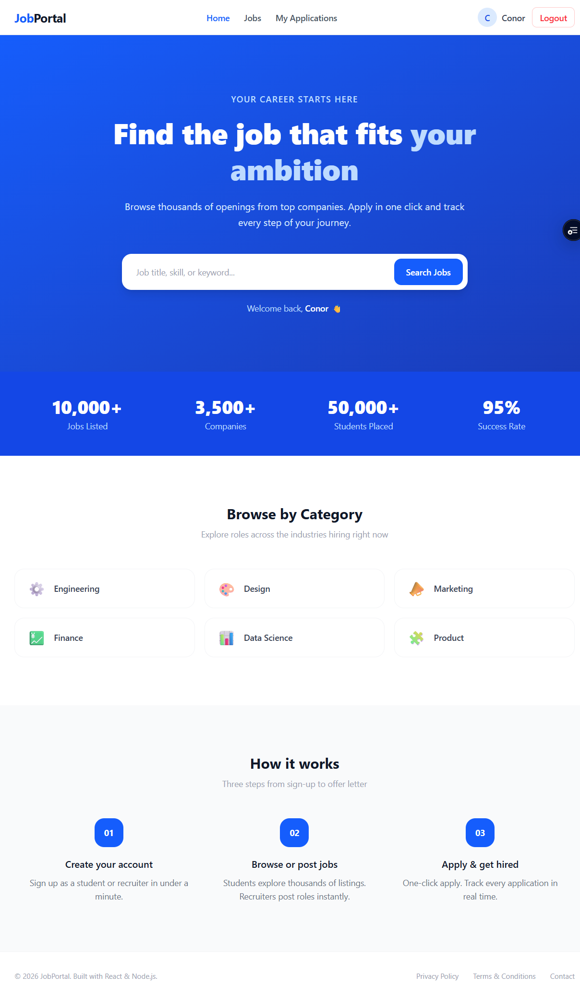
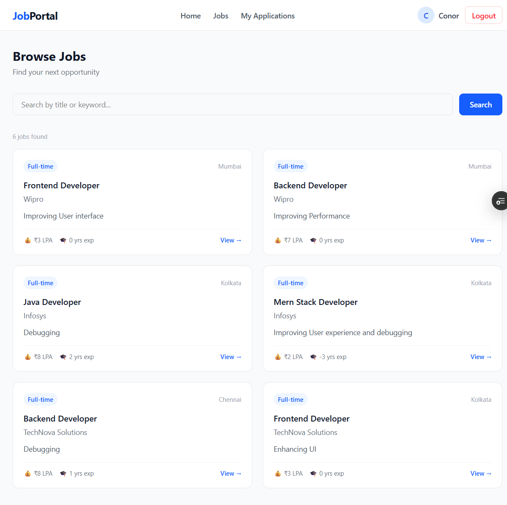
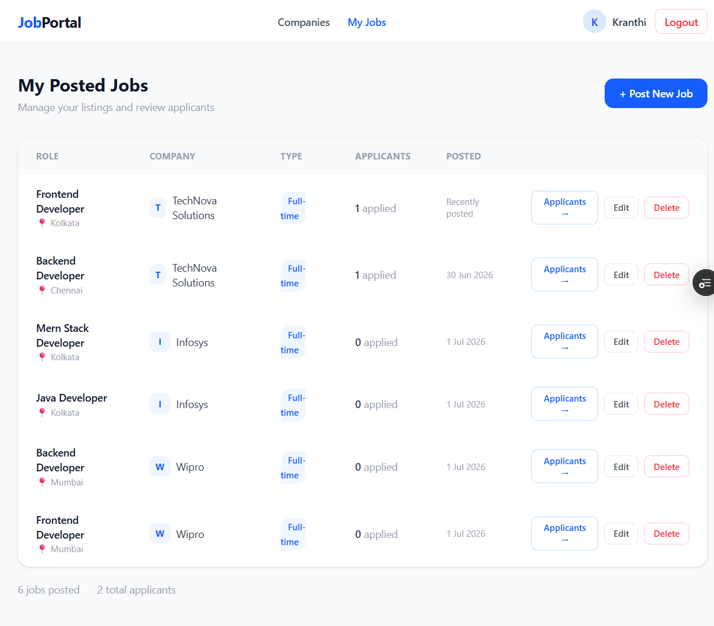
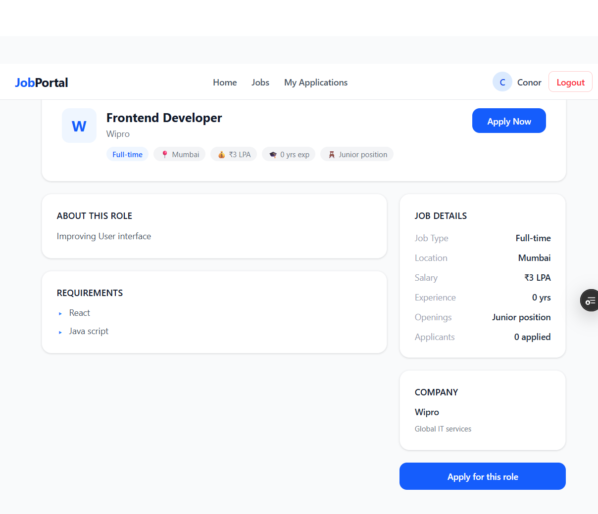

# 💼 Job Portal — Frontend

A full-stack job portal web application built with **React + Vite**, enabling students to discover and apply for jobs, and recruiters to post and manage listings — with role-based access control throughout.

🔗 **Live Demo:** [job-portal-frontend-seven-neon.vercel.app](https://job-portal-frontend-seven-neon.vercel.app)  
🔗 **Backend Repo:** [job-portal-backend](https://github.com/kranthikumar33/job-portal-backend)

---

## 🖼️ Screenshots



 




---

## ✨ Features

### 👨‍🎓 Student
- Register / Login with JWT-based authentication
- Browse and search job listings with pagination
- View full job details and apply with resume upload (Cloudinary)
- Track all applied jobs and their statuses (Pending / Accepted / Rejected)

### 🏢 Recruiter
- Register a company profile
- Post, edit, and delete job listings
- View all applicants per job
- Accept or reject applicants

### 🔐 Auth & Security
- JWT stored in HTTP-only cookies (secure, sameSite: none in production)
- Role-based access control (Student vs Recruiter)
- Protected routes — unauthorized users redirected automatically
- Login persistence via `/me` endpoint on page refresh

---

## 🛠️ Tech Stack


> **21 React components** across student, recruiter, and shared flows

---

## 📁 Project Structure

```
src/
├── api/
│   └── axios.js              # Axios instance with base URL
├── assets/                   # Images and static files
├── components/
│   ├── Navbar.jsx
│   └── ProtectedRoute.jsx
├── context/
│   └── AuthContext.jsx       # Global auth state with React Context
├── pages/
│   ├── recruiter/            # PostJob, EditJob, Applicants, CompanySetup
│   ├── student/              # Jobs, JobDetail, AppliedJobs
│   ├── Home.jsx
│   ├── JobDetail.jsx
│   ├── Jobs.jsx
│   ├── Login.jsx
│   ├── NotFound.jsx
│   ├── PrivacyPolicy.jsx
│   ├── Profile.jsx
│   ├── Signup.jsx
│   └── Terms.jsx
├── App.jsx                   # Routes with role-based protection
└── main.jsx
```

---

## ⚙️ Getting Started

### Prerequisites
- Node.js v18+
- Backend server running (see [backend repo](https://github.com/kranthikumar33/job-portal-backend))

### Installation

```bash
# Clone the repo
git clone https://github.com/kranthikumar33/job-portal-frontend.git
cd job-portal-frontend

# Install dependencies
npm install

# Create environment file
cp .env.example .env
```

### Environment Variables

```env
VITE_API_URL=http://localhost:5000/api
```

### Run Locally

```bash
npm run dev
```

App runs at `http://localhost:5173`

---

## 🚀 Deployment

Deployed on **Vercel** with a `vercel.json` SPA rewrite rule to handle client-side routing:

```json
{
  "rewrites": [{ "source": "/(.*)", "destination": "/" }]
}
```

---

## 🔗 Related

- 🔧 [Backend Repo (Node.js / Express / MongoDB)](https://github.com/kranthikumar33/job-portal-backend)

---

## 👤 Author

**Kranthi Kumar**  
[](https://linkedin.com/in/kranthi-kumar-chowdam)
[](https://github.com/kranthikumar33)
